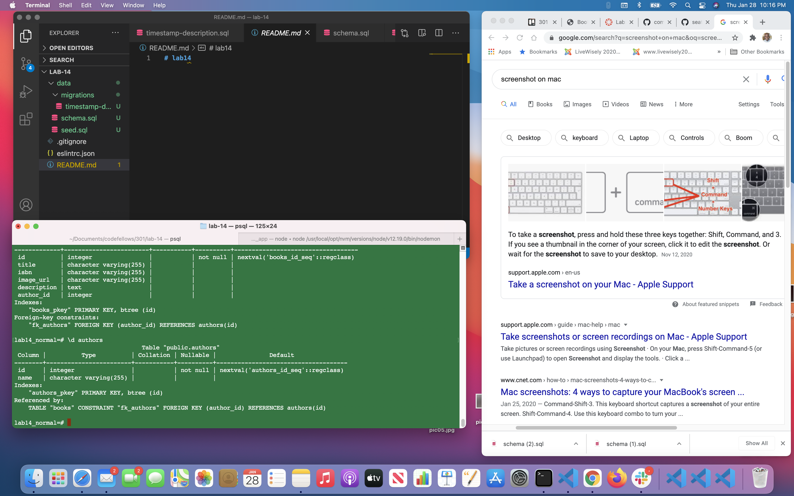

# lab14

## Databae setup

Number and name of feature: __Database Setup___

Estimate of time needed to complete: __15 min___

Start time: __9:00pm___

Finish time: __9:08pm___

Actual time needed to complete: __8 min___

Number and name of feature: __Database Migration___

Estimate of time needed to complete: __15 min___

1. In my PSQL shell, create a lab14 database: CREATE DATABASE lab14;.

1. Next I used the schema.sql file in the lab folder to populate your new database from the terminal prompt: psql -f /data/schema.sql -d lab14.

1. I then restartd PSQL and switched to lab14, then verified it has contents with: SELECT COUNT(*) FROM books;

1. This lab14 database is currently denormalized and it needed tobe normalized. Begin by creating a copy of the database with the following command:

**CREATE DATABASE lab14_normal WITH TEMPLATE lab14;**

1. I confirmed the success of this process by connecting to the lab14_normal database and typing **SELECT COUNT(*) FROM books;**, where I saw the same data you have in your existing database.

**Database Migration Process:**
Start time: __9:10pm___

Finish time: __9:20pm___

Actual time needed to complete: __10 min___

1. **Query 1:** CREATE TABLE AUTHORS (id SERIAL PRIMARY KEY, name VARCHAR(255));

    + This query created a second table in the lab14_normal database named authors. 
    + I Confirmed the success of this command by typing **\d authors** in your SQL shell. I saw see the authors table schema. 

1. **Query 2:** INSERT INTO authors(name) SELECT DISTINCT author FROM books;

    + This query used a simple subquery to retrieve unique author values from the books table and inserted each one into the authors table in the name column. 
    + I confirmed the success of this command by typing **SELECT COUNT(*) FROM authors; ** in the SQL shell. 

1. **Query 3:** ALTER TABLE books ADD COLUMN author_id INT;
    + This query added a column to the books table named author_id which connected each book to a specific author in the other table.
    + I confirm the success of this command by typing **\d books** in the SQL shell. The table schema now included a column for author_id, in addition to the column for the string author; the author column will be removed in Query 5.

1. **Query 4:** UPDATE books SET author_id=author.id FROM (SELECT * FROM authors) AS author WHERE books.author = author.name;

    + This query prepared a connection between the two tables. It worked by running a subquery for every row in the books table. The subquery finds the author row that has a name matching the current book’s author value. The id of that author row is then set as the value of the author_id property in the current book row.
    + I confirm the success of this command by typing **SELECT author_id FROM books;** in the SQL shell. The result should display a column containing the unique ids for the authors. The numbers should match the total number returned from Query 2 when you confirmed the success of the insertion of names into the authors table.

1. **Query 5:** ALTER TABLE books DROP COLUMN author;

    + This query modified the books table by removing the column named author. Now that the books table contains a author_id column which will become a foreign key, your table does not need to contain a string representing each author.
    + I confirmed the success of this command by typing **\d books** in the SQL shell. The books table schema should be updated to reflect the schema provided above, without the author column.

1. **Query 6:** ALTER TABLE books ADD CONSTRAINT fk_authors FOREIGN KEY (author_id) REFERENCES authors(id);

    + This query modified the data type of the author_id in the books table, setting it as a foreign key which references the primary key in the authors table. Now PostgreSQL knows HOW these 2 tables are connected.
    + I confirm the success of this command by typing **\d books** in the SQL shell. You should see details about the foreign key constraints, as shown in the schema above.

